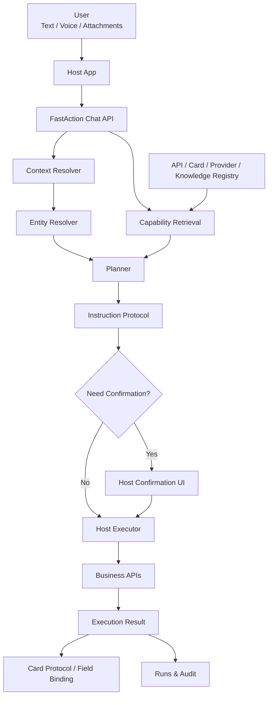

# FastAction

[English](README.md) | [简体中文](README.zh-CN.md)

**AI-powered API Orchestration Framework**

FastAction is an open-source framework for connecting existing enterprise system APIs to AI agents. It provides the registry, policy, context, dictionary, preparation, confirmation, execution, and audit layers required to turn natural language into safe, confirmable, auditable business API actions.

```text
Brand:      FastAction
Repository: fastaction-ai
Package:    fastaction-ai
Import:     fastaction
Category:   Natural Language API Orchestration
License:    Apache-2.0
```

> Status: early-stage design and foundation work. The public API may change before the first stable release.

## What Is FastAction?

FastAction is a **Natural Language API Orchestration Framework**. It is not a generic chatbot and not just a RAG layer.

It is designed for enterprises and product teams that already have internal systems, user permissions, business dictionaries, workflows, and a large number of existing APIs. FastAction helps expose those existing capabilities to AI agents without giving the model unrestricted access to internal systems.

It is designed to turn user requests into safe business actions:

```text
User asks an AI agent for a business action
  ↓
FastAction understands the intent
  ↓
FastAction retrieves matching registered enterprise API capabilities
  ↓
FastAction prepares parameters, resolves entities, maps dictionaries, and handles attachments
  ↓
FastAction checks host authorization, risk, and confirmation policy
  ↓
The host application executes the real API with the real user identity
  ↓
FastAction returns an orchestrated result, card protocol data, and audit traces
```

In short:

```text
Existing Enterprise APIs -> AI Agents -> Safe Business Workflows
```

## What Problem Does It Solve?

Traditional enterprises and SaaS products already have working systems: CRM, ERP, project management, ticketing, approval, asset management, internal admin platforms, and many private APIs. The challenge is not only how to call one API from an LLM. The harder problem is how to safely expose many existing APIs to AI agents while preserving enterprise-grade authorization, dictionaries, context, execution rules, and auditability.

Business APIs usually cover:

- list
- detail
- count
- aggregate
- create
- update
- delete
- workflow transition
- file upload
- approval, assignment, confirmation, and other domain actions

Users do not naturally say:

```text
Call GET /api/v1/tasks?status=pending.
```

They say:

```text
Show me my pending tasks.
List this customer's recent orders.
Attach this contract PDF to Acme customer.
Mark this task as completed.
Count new leads created this month.
```

FastAction lets host applications register their existing APIs as natural-language-invokable capabilities while preserving the controls required by real production systems:

- identity
- tenant boundary
- role-based permission
- parameter validation
- dictionary, option, and enum resolution
- context entity resolution
- attachment planning
- write-operation confirmation
- execution logs
- audit trace
- UI card binding

## Why Not Only Use A Generic Agent Framework?

Generic Agent frameworks are good at:

- connecting to LLMs
- defining tools
- letting models choose tools
- multi-step reasoning
- RAG retrieval

Real business API orchestration needs additional governance:

```text
Is this user allowed to call this API?
Which real ID does "Acme customer" refer to?
Is this field a business enum?
Should this attachment be uploaded first or submitted inline?
Is this a write operation that requires confirmation?
Which token should be used for execution?
Which UI card should render the result?
How should this decision be audited?
```

FastAction provides a business orchestration and governance layer between LLMs and real production APIs.

## Core Architecture



## Core Modules

| Module | Responsibility |
|---|---|
| API Registry | Register business API method, path, schema, operation type, and risk level |
| Provider Registry | Register LLM, embedding, ASR, and rerank providers |
| Context Registry | Register user, tenant, page, current resource, and business entity context sources |
| Entity Resolver | Resolve mentioned business entities into real IDs |
| Preparation Layer | Prepare parameters, dictionaries, options, queries, attachments, and preflight checks |
| Policy Engine | Coordinate with host authorization, tenant boundaries, risk, and confirmation policy |
| Planner | Generate structured plans from candidates, context, and policy |
| Instruction Protocol | Define actions such as `answer`, `clarify`, `confirm`, `invoke_api`, and `reject` |
| Host Executor | Execute real business APIs inside the host application with real user identity |
| Card Registry | Map API results to list, detail, metric, result, and custom cards |
| Runs & Audit | Record retrieval, planning, confirmation, execution, and errors |

## Documentation

- [Architecture](docs/ARCHITECTURE.md)
- [Workbench](docs/WORKBENCH.md)
- [Development Plan](docs/DEVELOPMENT_PLAN.md)
- [Migration Boundary](docs/MIGRATION_BOUNDARY.md)
- [Release Process](docs/RELEASE_PROCESS.md)
- [Worklog](docs/WORKLOG.md)

## Example API Definition

```yaml
id: tasks.my_todos
name: My Todo Tasks
operation: list
method: GET
path: /api/v1/tasks/my-todos
risk_level: low
permissions:
  - task:read
intent:
  examples:
    - Show my todo tasks
    - What tasks do I need to handle today?
parameters:
  - name: status
    in: query
    type: string
    optional: true
    preparation:
      type: option
      option_set: task_status
card:
  type: list_card
  bindings:
    title: $.title
    subtitle: $.customer_name
    status: $.status
```

## Example Instruction

```json
{
  "action": "confirm",
  "api_id": "tasks.complete",
  "confidence": 0.91,
  "summary": "Mark task 'Confirm material list' as completed.",
  "params": {
    "task_id": "task_123"
  },
  "risk_level": "medium",
  "requires_confirmation": true,
  "card": {
    "type": "result_card"
  }
}
```

## Relationship With LangChain And LangGraph

FastAction does not aim to replace LangChain or LangGraph.

Recommended boundary:

```text
LangChain / LangGraph:
  - model integration
  - tool calling loop
  - agent workflow
  - RAG pipeline
  - stateful multi-step orchestration

FastAction:
  - business API registry
  - context and entity resolution
  - permission and risk policy
  - parameter preparation
  - attachment plan
  - confirmation protocol
  - host execution boundary
  - card binding
  - business audit trail
```

LangChain and LangGraph can be optional FastAction runtime plugins. They should not replace FastAction's business governance layer.

## Security Boundary

FastAction is designed around these principles:

- Models do not freely access arbitrary HTTP endpoints.
- Models only see filtered candidate capabilities.
- Write operations can require confirmation by default.
- Real API execution happens inside the host application.
- Real authorization belongs to the host application.
- User tokens are not stored long-term by default.
- Business data belongs to the host application, not FastAction.
- FastAction records decision traces but does not replace the host audit system.

## Use Cases

FastAction is useful for:

- AI agent access layers for existing enterprise systems
- natural-language SaaS operations
- CRM, ERP, and project management systems
- internal admin platforms
- internal workflow automation
- support or advisor workbenches
- multi-tenant business systems
- AI operation entry points that require permission, confirmation, and audit
- teams that want to gradually make existing APIs AI-invokable

FastAction is not a good fit for:

- simple chatbot-only products
- pure content apps without structured APIs
- systems that intentionally allow models to freely call arbitrary URLs
- lightweight demos that do not require permission or audit controls

## Roadmap

```text
Phase 1:
  - Core schema
  - API Registry
  - Provider Registry
  - Instruction Protocol
  - Basic planner
  - Run records

Phase 2:
  - Context Registry
  - Entity Resolver
  - Option Resolver
  - Attachment Plan
  - Confirmation policy
  - Host Executor SDK

Phase 3:
  - OpenAPI import
  - LangChain runtime plugin
  - LangGraph runtime plugin
  - Admin workbench
  - Card examples
  - Production observability
```

## Contributing And Security

- Read [Contributing](CONTRIBUTING.md) before opening a pull request.
- Read [Security Policy](SECURITY.md) before reporting a vulnerability.
- Follow the [Code of Conduct](CODE_OF_CONDUCT.md) in project discussions.
- See [Changelog](CHANGELOG.md) for release notes and migration notes.

## License

Apache License 2.0.
