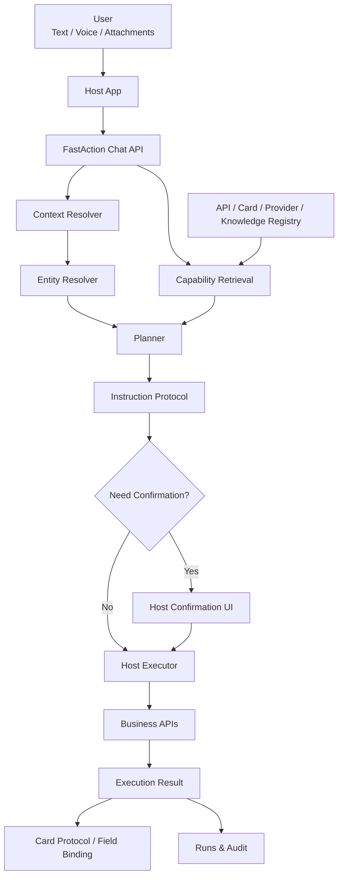

# FastAction

**AI-powered API Orchestration Framework**

FastAction is an open-source framework for turning natural language into safe, confirmable, auditable API actions.

FastAction 是一个开源的自然语言 API 编排框架，用于把用户的自然语言请求转成安全、可确认、可审计的业务 API 动作。

```text
Brand:      FastAction
Repository: fastaction-ai
Package:    fastaction-ai
Import:     fastaction
Category:   Natural Language API Orchestration
License:    Apache-2.0
```

> Status: early-stage design and foundation work. The public API may change before the first stable release.
>
> 当前状态：早期设计和基础工程阶段。首个稳定版本前，公开 API 可能调整。

---

## 中文

### FastAction 是什么？

FastAction 是一个 **自然语言 API 编排引擎**。它不是普通聊天机器人，也不是单纯的 RAG 知识库。

它解决的问题是：

```text
用户用自然语言表达需求
  ↓
系统理解意图
  ↓
从已注册能力中找到合适的 API
  ↓
解析参数、校准实体、识别枚举、处理附件
  ↓
判断权限、风险和是否需要确认
  ↓
由宿主系统使用真实用户身份执行业务 API
  ↓
返回结构化结果、卡片协议和审计记录
```

换句话说，FastAction 关注的是：

```text
Natural Language -> Safe Business Action
自然语言 -> 安全业务动作
```

### 它解决什么问题？

大多数业务系统都有大量 API：

- 列表查询
- 详情查询
- 统计数量
- 新增记录
- 编辑记录
- 状态流转
- 上传附件
- 审批、确认、分配、关闭等业务动作

但用户通常不会说“调用 `GET /api/v1/tasks?status=pending`”，而是会说：

```text
帮我看一下今天有哪些待办。
把这个客户最近的订单列出来。
上传这张图纸到测试项目。
把这个任务标记为已完成。
统计一下本月新增线索数量。
```

FastAction 的目标是让业务系统可以把自己的 API 注册为“可被自然语言调用的能力”，同时保留真实业务系统必须具备的安全控制：

- 用户身份
- 租户边界
- 角色权限
- 参数校验
- 字典和枚举识别
- 上下文实体校准
- 附件处理
- 写操作确认
- 执行日志
- 审计追踪
- UI 卡片绑定

### 为什么不是直接用一个 Agent 框架？

通用 Agent 框架通常擅长：

- 接入大模型
- 定义工具
- 让模型选择工具
- 多步骤推理
- RAG 检索

但真实业务 API 编排还需要更多工程约束：

```text
这个用户能不能调用这个 API？
这句话里的“测试项目”到底对应哪个真实 ID？
这个字段是不是业务枚举？
附件是先上传还是随请求提交？
这是写操作，要不要用户确认？
执行时应该使用哪个 token？
API 返回后应该渲染什么卡片？
这次决策链路如何审计？
```

FastAction 的定位是：在大模型和真实业务系统之间提供一层 **业务 API 编排与治理框架**。

### 核心设计



### 核心模块

| 模块 | 职责 |
|---|---|
| API Registry | 注册业务 API 的路径、方法、参数、返回结构、操作类型和风险等级 |
| Provider Registry | 注册 LLM、Embedding、ASR、Rerank 等 AI Provider |
| Context Registry | 注册用户、租户、当前页面、当前资源、业务实体列表等上下文来源 |
| Entity Resolver | 把自然语言中的业务对象校准成真实 ID |
| Preparation Layer | 处理参数准备、枚举识别、查询构造、附件计划和执行前检查 |
| Policy Engine | 判断角色权限、租户边界、风险等级和确认策略 |
| Planner | 基于候选能力、上下文和策略生成结构化执行计划 |
| Instruction Protocol | 定义 `answer`、`clarify`、`confirm`、`invoke_api`、`reject` 等动作 |
| Host Executor | 在宿主系统内使用真实用户身份执行业务 API |
| Card Registry | 定义 API 结果如何映射到列表卡、详情卡、统计卡、结果卡等展示协议 |
| Runs & Audit | 记录召回、规划、确认、执行和错误链路 |

### 注册一个 API 的示例

```yaml
id: tasks.my_todos
name: My Todo Tasks
operation: list
method: GET
path: /api/v1/tasks/my-todos
risk_level: low
permissions:
  - task:read
intent:
  examples:
    - Show my todo tasks
    - What tasks do I need to handle today?
    - 帮我看一下我的待办任务
parameters:
  - name: status
    in: query
    type: string
    optional: true
    preparation:
      type: option
      option_set: task_status
card:
  type: list_card
  bindings:
    title: $.title
    subtitle: $.project_name
    status: $.status
```

### 结构化指令示例

```json
{
  "action": "confirm",
  "api_id": "tasks.complete",
  "confidence": 0.91,
  "summary": "Mark task 'Confirm material list' as completed.",
  "params": {
    "task_id": "task_123"
  },
  "risk_level": "medium",
  "requires_confirmation": true,
  "card": {
    "type": "result_card"
  }
}
```

### 和 LangChain / LangGraph 的关系

FastAction 不试图替代 LangChain 或 LangGraph。

推荐边界是：

```text
LangChain / LangGraph:
  - model integration
  - tool calling loop
  - agent workflow
  - RAG pipeline
  - stateful multi-step orchestration

FastAction:
  - business API registry
  - context and entity resolution
  - permission and risk policy
  - parameter preparation
  - attachment plan
  - confirmation protocol
  - host execution boundary
  - card binding
  - business audit trail
```

LangChain / LangGraph 可以作为 FastAction 的可选 runtime 插件，而不是 FastAction 的业务治理核心。

### 安全边界

FastAction 的核心原则：

- 模型不能自由访问任意 HTTP 地址。
- 模型只看到经过筛选的候选能力。
- 写操作默认可以配置确认。
- 真实 API 调用发生在宿主系统内。
- 真实权限由宿主系统判定。
- 用户 token 默认不长期保存在 FastAction 中。
- 业务数据属于宿主系统，不属于 FastAction。
- FastAction 记录决策链路，但不替代业务审计系统。

### 适用场景

FastAction 适合：

- SaaS 后台自然语言操作
- CRM / ERP / 项目管理系统
- 内部运营管理平台
- 客服或顾问工作台
- 多租户业务系统
- 需要权限、确认和审计的 AI 操作入口
- 希望把现有 API 逐步变成 AI 可调用能力的系统

FastAction 不适合：

- 只需要普通聊天的产品
- 没有结构化业务 API 的纯内容应用
- 让模型直接自由访问互联网或内网的场景
- 完全不需要权限和审计的轻量 Demo

---

## English

### What is FastAction?

FastAction is a **Natural Language API Orchestration Framework**. It is not a generic chatbot and not just a RAG layer.

It is designed to turn user requests into safe business actions:

```text
User says what they want
  ↓
FastAction understands the intent
  ↓
FastAction retrieves matching registered capabilities
  ↓
FastAction prepares parameters, resolves entities, maps options, and handles attachments
  ↓
FastAction checks permissions, risk, and confirmation policy
  ↓
The host application executes the real business API with the real user identity
  ↓
FastAction returns structured results, card protocol data, and audit traces
```

In short:

```text
Natural Language -> Safe Business Action
```

### What problem does it solve?

Business systems usually have many APIs:

- list
- detail
- count
- aggregate
- create
- update
- delete
- workflow transition
- file upload
- approval, assignment, confirmation, and other domain actions

Users do not naturally say:

```text
Call GET /api/v1/tasks?status=pending.
```

They say:

```text
Show me my pending tasks.
List this customer's recent orders.
Upload this drawing to the test project.
Mark this task as completed.
Count new leads created this month.
```

FastAction lets host applications register their APIs as natural-language-invokable capabilities while preserving the controls required by real production systems:

- identity
- tenant boundary
- role-based permission
- parameter validation
- option and enum resolution
- context entity resolution
- attachment planning
- write-operation confirmation
- execution logs
- audit trace
- UI card binding

### Why not only use a generic Agent framework?

Generic Agent frameworks are good at:

- connecting to LLMs
- defining tools
- letting models choose tools
- multi-step reasoning
- RAG retrieval

Real business API orchestration needs additional governance:

```text
Is this user allowed to call this API?
Which real ID does "test project" refer to?
Is this field a business enum?
Should this attachment be uploaded first or submitted inline?
Is this a write operation that requires confirmation?
Which token should be used for execution?
Which UI card should render the result?
How should this decision be audited?
```

FastAction provides a business orchestration and governance layer between LLMs and real production APIs.

### Core architecture


### Core modules

| Module | Responsibility |
|---|---|
| API Registry | Register business API method, path, schema, operation type, and risk level |
| Provider Registry | Register LLM, embedding, ASR, and rerank providers |
| Context Registry | Register user, tenant, page, current resource, and business entity context sources |
| Entity Resolver | Resolve mentioned business entities into real IDs |
| Preparation Layer | Prepare parameters, options, queries, attachments, and preflight checks |
| Policy Engine | Check permissions, tenant boundaries, risk, and confirmation policy |
| Planner | Generate structured plans from candidates, context, and policy |
| Instruction Protocol | Define actions such as `answer`, `clarify`, `confirm`, `invoke_api`, and `reject` |
| Host Executor | Execute real business APIs inside the host application with real user identity |
| Card Registry | Map API results to list, detail, metric, result, and custom cards |
| Runs & Audit | Record retrieval, planning, confirmation, execution, and errors |

### Example API definition

```yaml
id: tasks.my_todos
name: My Todo Tasks
operation: list
method: GET
path: /api/v1/tasks/my-todos
risk_level: low
permissions:
  - task:read
intent:
  examples:
    - Show my todo tasks
    - What tasks do I need to handle today?
    - 帮我看一下我的待办任务
parameters:
  - name: status
    in: query
    type: string
    optional: true
    preparation:
      type: option
      option_set: task_status
card:
  type: list_card
  bindings:
    title: $.title
    subtitle: $.project_name
    status: $.status
```

### Example instruction

```json
{
  "action": "confirm",
  "api_id": "tasks.complete",
  "confidence": 0.91,
  "summary": "Mark task 'Confirm material list' as completed.",
  "params": {
    "task_id": "task_123"
  },
  "risk_level": "medium",
  "requires_confirmation": true,
  "card": {
    "type": "result_card"
  }
}
```

### Relationship with LangChain and LangGraph

FastAction does not aim to replace LangChain or LangGraph.

Recommended boundary:

```text
LangChain / LangGraph:
  - model integration
  - tool calling loop
  - agent workflow
  - RAG pipeline
  - stateful multi-step orchestration

FastAction:
  - business API registry
  - context and entity resolution
  - permission and risk policy
  - parameter preparation
  - attachment plan
  - confirmation protocol
  - host execution boundary
  - card binding
  - business audit trail
```

LangChain and LangGraph can be optional FastAction runtime plugins. They should not replace FastAction's business governance layer.

### Security boundary

FastAction is designed around these principles:

- Models do not freely access arbitrary HTTP endpoints.
- Models only see filtered candidate capabilities.
- Write operations can require confirmation by default.
- Real API execution happens inside the host application.
- Real authorization belongs to the host application.
- User tokens are not stored long-term by default.
- Business data belongs to the host application, not FastAction.
- FastAction records decision traces but does not replace the host audit system.

### Use cases

FastAction is useful for:

- natural-language SaaS operations
- CRM, ERP, and project management systems
- internal admin platforms
- support or advisor workbenches
- multi-tenant business systems
- AI operation entry points that require permission, confirmation, and audit
- teams that want to gradually make existing APIs AI-invokable

FastAction is not a good fit for:

- simple chatbot-only products
- pure content apps without structured APIs
- systems that intentionally allow models to freely call arbitrary URLs
- lightweight demos that do not require permission or audit controls

---

## Roadmap

```text
Phase 1:
  - Core schema
  - API Registry
  - Provider Registry
  - Instruction Protocol
  - Basic planner
  - Run records

Phase 2:
  - Context Registry
  - Entity Resolver
  - Option Resolver
  - Attachment Plan
  - Confirmation policy
  - Host Executor SDK

Phase 3:
  - OpenAPI import
  - LangChain runtime plugin
  - LangGraph runtime plugin
  - Admin workbench
  - Card examples
  - Production observability
```

## License

Apache License 2.0.
