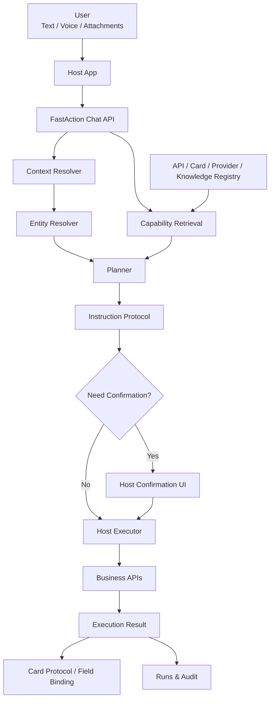

# FastAction

[English](README.md) | [简体中文](README.zh-CN.md)

**AI-powered API Orchestration Framework**

FastAction 是一个开源框架，用于把企业既有系统 API 接入 AI 智能体。它提供 API 注册、权限协同、上下文、字典、调用准备、确认、执行编排和审计能力，把自然语言请求转成安全、可确认、可审计的业务 API 动作。

```text
品牌名：    FastAction
仓库名：    fastaction-ai
包名：      fastaction-ai
Import：    fastaction
类别：      Natural Language API Orchestration
许可证：    Apache-2.0
```

> 当前状态：早期设计和基础工程阶段。首个稳定版本前，公开 API 可能调整。

## FastAction 是什么？

FastAction 是一个 **自然语言 API 编排引擎**。它不是普通聊天机器人，也不是单纯的 RAG 知识库。

它面向已经有内部系统、用户权限、业务字典、工作流和大量既有 API 的企业或产品团队。FastAction 的作用是把这些既有能力安全地暴露给 AI 智能体，而不是让模型自由访问企业内部系统。

它解决的问题是：

```text
用户向 AI 智能体表达业务需求
  ↓
系统理解意图
  ↓
从已注册的企业 API 能力中找到合适的 API
  ↓
解析参数、校准实体、识别字典和枚举、处理附件
  ↓
判断宿主系统权限、风险和是否需要确认
  ↓
由宿主系统使用真实用户身份执行业务 API
  ↓
返回编排后的结果、卡片协议和审计记录
```

换句话说，FastAction 关注的是：

```text
Existing Enterprise APIs -> AI Agents -> Safe Business Workflows
企业既有 API -> AI 智能体 -> 安全业务流程
```

## 它解决什么问题？

传统企业和 SaaS 产品通常已经有成熟的内部系统：CRM、ERP、项目管理、工单、审批、资产管理、内部管理后台，以及大量私有 API。真正的问题不只是“让大模型调用一个 API”，而是如何把大量既有 API 安全地接入 AI 智能体，同时保留企业级的权限、字典、上下文、执行规则和审计能力。

业务 API 通常包括：

- 列表查询
- 详情查询
- 统计数量
- 新增记录
- 编辑记录
- 状态流转
- 上传附件
- 审批、确认、分配、关闭等业务动作

但用户通常不会说：

```text
调用 GET /api/v1/tasks?status=pending。
```

而是会说：

```text
帮我看一下今天有哪些待办。
把这个客户最近的订单列出来。
把这份合同附件上传到 Acme 客户记录里。
把这个任务标记为已完成。
统计一下本月新增线索数量。
```

FastAction 的目标是让业务系统可以把既有 API 注册为“可被自然语言调用的能力”，同时保留真实业务系统必须具备的安全控制：

- 用户身份
- 租户边界
- 角色权限
- 参数校验
- 字典和枚举识别
- 上下文实体校准
- 附件处理
- 写操作确认
- 执行日志
- 审计追踪
- UI 卡片绑定

## 为什么不是直接用一个 Agent 框架？

通用 Agent 框架通常擅长：

- 接入大模型
- 定义工具
- 让模型选择工具
- 多步骤推理
- RAG 检索

但真实业务 API 编排还需要更多工程约束：

```text
这个用户能不能调用这个 API？
这句话里的“Acme 客户”到底对应哪个真实 ID？
这个字段是不是业务枚举？
附件是先上传还是随请求提交？
这是写操作，要不要用户确认？
执行时应该使用哪个 token？
API 返回后应该渲染什么卡片？
这次决策链路如何审计？
```

FastAction 的定位是：在大模型和真实业务系统之间提供一层 **业务 API 编排与治理框架**。

## 核心设计



## 核心模块

| 模块 | 职责 |
|---|---|
| API Registry | 注册业务 API 的路径、方法、参数、返回结构、操作类型和风险等级 |
| Provider Registry | 注册 LLM、Embedding、ASR、Rerank 等 AI Provider |
| Context Registry | 注册用户、租户、当前页面、当前资源、业务实体列表等上下文来源 |
| Entity Resolver | 把自然语言中的业务对象校准成真实 ID |
| Preparation Layer | 处理参数准备、字典识别、枚举识别、查询构造、附件计划和执行前检查 |
| Policy Engine | 协同宿主系统权限、租户边界、风险等级和确认策略 |
| Planner | 基于候选能力、上下文和策略生成结构化执行计划 |
| Instruction Protocol | 定义 `answer`、`clarify`、`confirm`、`invoke_api`、`reject` 等动作 |
| Host Executor | 在宿主系统内使用真实用户身份执行业务 API |
| Card Registry | 定义 API 结果如何映射到列表卡、详情卡、统计卡、结果卡等展示协议 |
| Runs & Audit | 记录召回、规划、确认、执行和错误链路 |

## 文档

- [快速指引](docs/QUICKSTART.zh-CN.md)
- [Quickstart](docs/QUICKSTART.md)
- [架构设计](docs/ARCHITECTURE.md)
- [工作台设计](docs/WORKBENCH.md)
- [开发计划](docs/DEVELOPMENT_PLAN.md)
- [迁移边界](docs/MIGRATION_BOUNDARY.md)
- [发布流程](docs/RELEASE_PROCESS.md)
- [工作日志](docs/WORKLOG.md)

## API 注册示例

```yaml
id: tasks.my_todos
name: 我的待办任务
operation: list
method: GET
path: /api/v1/tasks/my-todos
risk_level: low
permissions:
  - task:read
intent:
  examples:
    - 帮我看一下我的待办任务
    - 今天有哪些任务需要我处理？
parameters:
  - name: status
    in: query
    type: string
    optional: true
    preparation:
      type: option
      option_set: task_status
card:
  type: list_card
  bindings:
    title: $.title
    subtitle: $.customer_name
    status: $.status
```

字典和枚举也是注册数据，不应该硬编码在引擎里：

```json
{
  "id": "task_status",
  "name": { "zh": "任务状态" },
  "host_app": "example",
  "category": "enum",
  "options": [
    { "value": "todo", "label": { "zh": "待办" }, "aliases": ["未处理", "待处理"] },
    { "value": "done", "label": { "zh": "完成" }, "aliases": ["已完成"] }
  ]
}
```

`value` 就是业务 API 最终要传的 code，`label` 是给人和模型看的 name，`aliases` 是自然语言识别辅助词。注册时也兼容 `code/name` 写法，FastAction 会规范化成 `value/label`。

`APIDefinition.parameters.properties.<name>.option_set` 引用已注册字典。调用准备层会用 label 和 aliases 把自然语言值校准成 API 需要的规范值。

```http
GET /api/v1/fastaction/option-sets/task_status
POST /api/v1/fastaction/option-sets/task_status/resolve
```

```json
{
  "text": "这个任务还是待处理"
}
```

返回：

```json
{
  "matched": true,
  "option": {
    "code": "todo",
    "value": "todo",
    "name": "待办"
  }
}
```

## 结构化指令示例

```json
{
  "action": "confirm",
  "api_id": "tasks.complete",
  "confidence": 0.91,
  "summary": "将任务“确认材料清单”标记为已完成。",
  "params": {
    "task_id": "task_123"
  },
  "risk_level": "medium",
  "requires_confirmation": true,
  "card": {
    "type": "result_card"
  }
}
```

## 和 LangChain / LangGraph 的关系

FastAction 不试图替代 LangChain 或 LangGraph。

推荐边界是：

```text
LangChain / LangGraph:
  - model integration
  - tool calling loop
  - agent workflow
  - RAG pipeline
  - stateful multi-step orchestration

FastAction:
  - business API registry
  - context and entity resolution
  - permission and risk policy
  - parameter preparation
  - attachment plan
  - confirmation protocol
  - host execution boundary
  - card binding
  - business audit trail
```

LangChain / LangGraph 可以作为 FastAction 的可选 runtime 插件，而不是 FastAction 的业务治理核心。

## 安全边界

FastAction 的核心原则：

- 模型不能自由访问任意 HTTP 地址。
- 模型只看到经过筛选的候选能力。
- 写操作默认可以配置确认。
- 真实 API 调用发生在宿主系统内。
- 真实权限由宿主系统判定。
- 用户 token 默认不长期保存在 FastAction 中。
- 业务数据属于宿主系统，不属于 FastAction。
- FastAction 记录决策链路，但不替代业务审计系统。

## 适用场景

FastAction 适合：

- 企业既有系统接入 AI 智能体
- SaaS 后台自然语言操作
- CRM / ERP / 项目管理系统
- 内部运营管理平台
- 内部工作流自动化
- 客服或顾问工作台
- 多租户业务系统
- 需要权限、确认和审计的 AI 操作入口
- 希望把现有 API 逐步变成 AI 可调用能力的系统

FastAction 不适合：

- 只需要普通聊天的产品
- 没有结构化业务 API 的纯内容应用
- 让模型直接自由访问互联网或内网的场景
- 完全不需要权限和审计的轻量 Demo

## Roadmap

```text
Phase 1:
  - Core schema
  - API Registry
  - Provider Registry
  - Instruction Protocol
  - Basic planner
  - Run records

Phase 2:
  - Context Registry
  - Entity Resolver
  - Option Resolver
  - Attachment Plan
  - Confirmation policy
  - Host Executor SDK

Phase 3:
  - OpenAPI import
  - LangChain runtime plugin
  - LangGraph runtime plugin
  - Admin workbench
  - Card examples
  - Production observability
```

## 贡献与安全

- 提交 PR 前请先阅读 [贡献指南](CONTRIBUTING.md)。
- 报告安全漏洞前请先阅读 [安全策略](SECURITY.md)。
- 项目讨论请遵守 [行为准则](CODE_OF_CONDUCT.md)。
- 版本变化和迁移说明见 [更新日志](CHANGELOG.md)。

## License

Apache License 2.0.
