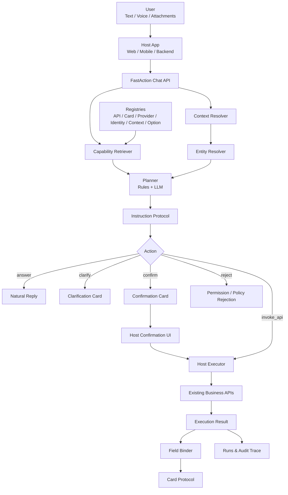

# FastAction Architecture / 架构设计

FastAction is an AI-powered API orchestration framework for connecting existing enterprise APIs to AI agents.

FastAction 是一个把企业既有系统 API 接入 AI 智能体的编排框架。它的核心不是替代业务系统，而是在大模型和真实业务 API 之间提供注册、召回、参数准备、权限协同、确认、执行边界、卡片协议和审计链路。

## 1. Positioning / 定位

```text
Host Application
  Owns users, tenants, business data, real API execution, and real authorization.

FastAction
  Owns API capability registry, AI provider registry, context/entity resolution,
  parameter preparation, policy planning, confirmation protocol, card binding,
  and run trace.

LLM Provider
  Helps classify intent, select a capability from a bounded candidate set,
  extract parameters, and produce safe natural-language replies.
```

```text
宿主业务系统
  负责用户、租户、业务数据、真实 API 执行和真实鉴权。

FastAction
  负责能力注册、AI Provider 注册、上下文和实体校准、参数准备、
  策略规划、确认协议、卡片绑定和运行链路记录。

大模型 Provider
  只在受限候选能力中帮助识别意图、选择能力、抽取参数和生成安全回复。
```

FastAction is not a generic chatbot, not a pure RAG system, and not a free-form HTTP tool caller.

FastAction 不是普通聊天机器人，不是单纯 RAG，也不是允许模型自由访问任意 HTTP 地址的工具调用器。

## 2. Boundary / 边界

```text
Belongs in FastAction:
  - API Definition schema
  - Card Definition schema
  - Provider Definition schema
  - Identity Definition schema
  - Context Entity Definition schema
  - Option Definition schema
  - Attachment Plan schema
  - Instruction Protocol
  - Candidate retrieval
  - Planner
  - Policy and confirmation protocol
  - Field binding
  - Run trace and audit envelope
  - Generic workbench and test bench

Belongs in the Host Application:
  - Business API registration data
  - User and tenant tables
  - Real access tokens and secrets
  - Real business records
  - Business-specific adapters
  - Final permission decision
  - Actual API execution
  - Production audit system
```

```text
属于 FastAction：
  - API 定义协议
  - 卡片定义协议
  - Provider 定义协议
  - 身份定义协议
  - 上下文实体定义协议
  - 字典和枚举定义协议
  - 附件计划协议
  - 结构化指令协议
  - 候选能力召回
  - Planner
  - 策略和确认协议
  - 字段绑定
  - 运行 Trace 和审计信封
  - 通用注册工作台和测试台

属于宿主业务系统：
  - 具体业务 API 注册数据
  - 用户和租户表
  - 真实 token 和密钥
  - 真实业务数据
  - 业务适配器
  - 最终权限判定
  - 实际 API 执行
  - 生产审计系统
```

## 3. Runtime Architecture / 运行架构



## 4. Core Modules / 核心模块

| Module | Responsibility | 职责 |
|---|---|---|
| API Registry | Register existing business APIs as AI-invokable capabilities | 把既有业务 API 注册成 AI 可调用能力 |
| Provider Registry | Register LLM, embedding, ASR, and rerank providers | 注册大模型、Embedding、ASR、Rerank Provider |
| Identity Registry | Define actor templates, role aliases, policy scope, and system prompts | 定义身份模板、角色别名、权限范围和系统提示词 |
| Context Registry | Define resolvable business entity types and candidate providers | 定义可校准的业务实体类型和候选来源 |
| Option Registry | Resolve enums, dictionaries, categories, and status values | 解析枚举、字典、分类和状态 |
| Host Executor Registry | Register execution contracts and bind APIs to host-owned implementations | 注册执行契约，并把 API 绑定到宿主实现 |
| Attachment Planner | Normalize pre-upload, inline multipart, and post-execution attachment flows | 统一前置上传、随请求提交和后置附件流程 |
| Candidate Retriever | Select relevant API candidates by rules, keywords, embeddings, permissions, and context | 基于规则、关键词、Embedding、权限和上下文筛选候选 API |
| Planner | Choose action and produce structured instructions | 选择动作并生成结构化指令 |
| Policy Engine | Apply risk level, permission, tenant, and confirmation rules | 应用风险、权限、租户和确认策略 |
| Host Executor | Keep real API execution inside the host application | 让真实 API 调用留在宿主业务系统内 |
| Field Binder | Map API responses to card props | 把 API 返回映射为卡片 props |
| Runs & Audit | Record retrieval, planning, confirmation, execution, and errors | 记录召回、规划、确认、执行和错误链路 |

## 5. API Definition / API 定义

Execution is a contract, not hidden code inside FastAction Core:

```json
{
  "execution": {
    "mode": "host_executor",
    "executor_id": "example.host_proxy",
    "requires_confirmation": true,
    "input_mapping": {},
    "endpoints": {},
    "metadata": {}
  }
}
```

The executor itself is registered separately:

```json
{
  "id": "example.host_proxy",
  "host_app": "example",
  "kind": "host_proxy",
  "matcher": { "api_ids": ["tasks.my_todos"] },
  "runtime": { "implementation": "host_app" }
}
```

FastAction stores the definition, planning result, and ExecutionResult. The Host App owns real runtime code, current user tokens, file handles, and business-side permission checks.

执行是协议，不是藏在 FastAction Core 里的业务代码。FastAction 保存执行器定义、规划结果和 ExecutionResult；宿主系统负责真实执行代码、当前用户 token、文件对象和业务权限复核。

```json
{
  "id": "tasks.my_todos",
  "name": {
    "zh": "我的待办任务",
    "en": "My todo tasks"
  },
  "status": "active",
  "operation_type": "list",
  "intent": {
    "description": {
      "zh": "查询当前用户的待办任务。",
      "en": "List todo tasks visible to the current user."
    },
    "examples": {
      "zh": ["我有哪些待办", "今天有什么要处理"],
      "en": ["Show my todo tasks", "What do I need to handle today"]
    },
    "keywords": {
      "zh": ["待办", "任务"],
      "en": ["todo", "task"]
    }
  },
  "request": {
    "method": "GET",
    "endpoint": "/api/v1/tasks/my-todos",
    "auth": {
      "mode": "user_token",
      "token_context_path": "auth.access_token"
    }
  },
  "parameters": {
    "type": "object",
    "required": [],
    "properties": {
      "workspace_id": {
        "type": "string",
        "source": [
          "context.current_workspace.id",
          "entity.workspace.id",
          "explicit.workspace_id"
        ],
        "resolve_entity": "workspace"
      },
      "status": {
        "type": "string",
        "source": ["option.task_status", "explicit.status"],
        "option_set": "task_status"
      }
    }
  },
  "policy": {
    "risk": "read",
    "requires_confirmation": false,
    "permissions": ["tasks:read"]
  },
  "render": {
    "card_type": "list_card",
    "field_bindings": {
      "title": "My todo tasks",
      "items": "$.data.tasks",
      "summary.count": "$.data.count"
    }
  }
}
```

## 6. Context Definition / 上下文实体定义

Context definitions make business objects resolvable from natural language. A host may define `workspace`, `customer`, `order`, `ticket`, `asset`, or any other entity type.

上下文实体用于把自然语言里的业务对象校准成真实 ID。宿主系统可以定义 `workspace`、`customer`、`order`、`ticket`、`asset` 等任意实体。

```json
{
  "id": "customer",
  "name": {
    "zh": "客户",
    "en": "Customer"
  },
  "id_field": "id",
  "label_fields": ["name", "alias", "code"],
  "description_fields": ["status", "level"],
  "provider_id": "customers.accessible_list",
  "match": {
    "strategies": ["exact", "alias", "fuzzy", "embedding"],
    "auto_select_threshold": 0.86,
    "clarify_threshold": 0.62,
    "max_candidates": 5
  },
  "prompt": {
    "visible_fields": ["id", "name", "code", "status"],
    "redacted_fields": ["phone", "email"]
  }
}
```

## 7. Option Definition / 字典和枚举定义

```json
{
  "id": "task_status",
  "name": {
    "zh": "任务状态",
    "en": "Task status"
  },
  "source": {
    "type": "static",
    "items": [
      {"value": "todo", "labels": ["待办", "todo", "pending"]},
      {"value": "done", "labels": ["完成", "done", "completed"]}
    ]
  },
  "match": {
    "strategies": ["exact", "alias", "fuzzy"],
    "clarify_threshold": 0.65
  }
}
```

## 8. Attachment Plan / 附件计划

Attachments are a common preparation problem. FastAction should not store binary files by default. It creates a plan; the host performs real upload and transaction handling.

附件是通用调用准备问题。FastAction 默认不长期保存二进制文件，只生成计划；真实上传和事务处理由宿主系统完成。

```json
{
  "mode": "pre_upload",
  "file_param": "file_id",
  "accepted_mime_types": [
    "image/*",
    "application/pdf",
    "video/*",
    "audio/*",
    "application/acad",
    "application/x-acad",
    "application/octet-stream"
  ],
  "accepted_extensions": [".pdf", ".jpg", ".jpeg", ".png", ".webp", ".mp4", ".mov", ".mp3", ".wav", ".dwg", ".dxf"],
  "max_size_mb": 30,
  "metadata_params": ["category", "description"],
  "binary_owner": "host_app",
  "transaction": {
    "strategy": "host_managed",
    "rollback_on_api_failure": true
  }
}
```

Supported modes:

```text
pre_upload:
  Host uploads files first, then FastAction passes file IDs to the target API.

inline_multipart:
  Host submits files with the target API request.

post_execution:
  Host executes the business API first, then attaches files to the created resource.
```

## 9. Identity and Policy / 身份和策略

```json
{
  "id": "business-operator",
  "host_app": "example",
  "actor_type": "operator",
  "role_aliases": ["operator", "member"],
  "permissions": ["tasks:read", "tasks:write"],
  "allowed_api_ids": [],
  "denied_api_ids": [],
  "system_prompt": {
    "zh": "你是企业系统操作助手，只能在已注册能力和当前权限范围内回答或发起动作。",
    "en": "You are an enterprise operations assistant. Stay within registered capabilities and current permissions."
  },
  "is_active": true
}
```

Permission denial is different from no-match.

权限拒绝和能力未命中必须区分：

```text
No match:
  FastAction did not find a suitable registered capability.

Permission denied:
  FastAction found a capability, but the current identity or context is not allowed to use it.
  The reply should name the capability, explain the missing permission, and show who can perform it when known.
```

## 10. Confirmation Protocol / 确认协议

```json
{
  "action": "confirm",
  "api_id": "tasks.complete",
  "confidence": 0.91,
  "summary": {
    "zh": "将任务“确认合同版本”标记为完成。",
    "en": "Mark task 'Confirm contract version' as completed."
  },
  "params": {
    "task_id": "task_123"
  },
  "risk_level": "write",
  "requires_confirmation": true,
  "confirmation": {
    "title": "Complete task",
    "fields": ["task.name", "task.status"],
    "skip_policy": {
      "allowed": true,
      "ttl_seconds": 604800,
      "fingerprint_fields": ["task_id", "target_status"]
    }
  }
}
```

Default policy:

```text
read:
  Usually no confirmation.

write:
  Confirm by default; optional per-user skip may be allowed for low-impact, reversible actions.

destructive / external:
  Always confirm. Never allow global skip.
```

## 11. Provider Registry / Provider 注册

```json
{
  "id": "qwen-balanced-service",
  "provider": "qwen",
  "base_url": "https://dashscope.aliyuncs.com/compatible-mode/v1",
  "model": "auto",
  "capabilities": ["chat", "json_schema", "model_pool", "balanced_routing"],
  "credentials": {
    "mode": "server_secret",
    "secret_ref": "DASHSCOPE_API_KEY"
  },
  "routing": {
    "tasks": ["planning", "chat"],
    "priority": 6
  }
}
```

Provider integrations are plugins. The core registry supports OpenAI-compatible providers and dedicated adapters for OpenAI, Anthropic, Qwen, Doubao, Mimo, and DeepSeek.

Provider 是插件。核心注册表支持 OpenAI-compatible 协议，并提供 OpenAI、Anthropic、Qwen、Doubao、Mimo、DeepSeek 等接入适配。

Model-pool status is addressed by registered provider ID, not by a hard-coded vendor path:

```text
GET /fastaction/provider-configs/{provider_id}/model-pool
```

If a provider declares `model_pool` or `balanced_routing`, the Workbench can display its observable pool status. Provider-specific inspectors are plugin behavior; Qwen is one registered preset, not a special UI dependency.

模型池状态按已注册的 Provider ID 查询，而不是按写死的厂商路径查询：

```text
GET /fastaction/provider-configs/{provider_id}/model-pool
```

当 Provider 声明 `model_pool` 或 `balanced_routing` 能力时，Workbench 可以展示可观测的模型池状态。厂商专属探测逻辑属于 Provider 插件能力；Qwen 只是一个已注册 preset，不是 UI 特殊依赖。

## 12. Card Protocol / 卡片协议

```json
{
  "card_type": "list_card",
  "name": {
    "zh": "通用列表卡",
    "en": "Generic list card"
  },
  "data_contract": {
    "type": "object",
    "required": ["title", "items"]
  },
  "states": ["loading", "success", "empty", "error"]
}
```

Cards are examples and UI contracts, not business logic. Host applications can register their own cards and bind API response fields to card props.

卡片是展示协议和样例，不是业务逻辑。宿主系统可以注册自己的卡片，并把 API 返回字段绑定到卡片 props。

Card definitions are split into three tiers:

```text
Protocol cards:
  FastAction core contracts such as list_card, detail_card, metric_card,
  result_card, confirm_card, picker_card, missing_params_card,
  and generic_data_card.

Business examples:
  Enterprise patterns such as todo_card, progress_card, risk_alert_card,
  and attachment result cards. They are examples, not core.

Host UI samples:
  Product-specific UI such as chat bubbles, homepage modules, quick chips,
  and notification rows. They belong to host adapters.
```

卡片定义分三层：

```text
协议核心卡片：
  FastAction 核心协议，例如 list_card、detail_card、metric_card、
  result_card、confirm_card、picker_card、missing_params_card、
  generic_data_card。

企业业务样例：
  todo_card、progress_card、risk_alert_card、附件结果卡等企业常见模式。
  它们是样例，不是核心。

宿主 UI 样例：
  聊天气泡、首页模块、快捷问题、通知行等产品专属 UI。
  它们属于 Host Adapter。
```

The Card Gallery exposes these tiers visually and provides copyable `CardDefinition`, `render.field_bindings`, and sample response JSON.

Card Gallery 会可视化展示这些分层，并提供可复制的 `CardDefinition`、`render.field_bindings` 和示例响应 JSON。

## 13. Persistence / 持久化

FastAction can run with an in-memory registry for development. In production, it should use its own schema or database namespace.

FastAction 开发阶段可以使用内存注册表。生产建议使用独立 schema 或独立数据库命名空间。

```text
Recommended tables:
  fastaction.api_definitions
  fastaction.card_definitions
  fastaction.card_bindings
  fastaction.host_executor_definitions
  fastaction.provider_configs
  fastaction.identity_definitions
  fastaction.knowledge_definitions
  fastaction.option_sets
  fastaction.run_records
  fastaction.execution_results
  fastaction.test_messages
```

Data ownership rule:

```text
FastAction stores definitions, configuration, and traces.
Host applications store business records, business attachments, and real secrets.
```

## 14. Runtime Modes / 运行模式

```text
deterministic:
  Rules, keywords, source/default parameters, and policy only.

hybrid:
  Retrieve candidates locally, then ask a provider to choose and fill structured output.
  Recommended default.

llm:
  Require provider availability. Fail closed if the provider is unavailable.
```

## 15. Security / 安全原则

```text
1. Never expose arbitrary internal endpoints to the model.
2. Only send filtered candidate API definitions to the model.
3. Let the host application make final authorization decisions.
4. Do not store user tokens long term by default.
5. Require confirmation for write/destructive/external actions.
6. Redact context fields before they enter prompts.
7. Record planner decisions, selected API, parameters, provider, model version, and errors.
8. Treat no-match, clarify, permission-denied, and provider failure as different user-visible states.
```
