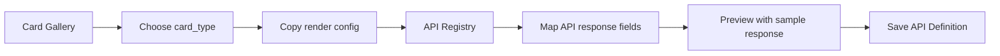

# FastAction Card Gallery

The Card Gallery is the visual and contract catalog for FastAction cards. It helps developers choose a card, copy the protocol JSON, and bind API response fields during API registration.

```text
Route:
  Workbench: /fastaction/cards

Primary users:
  - platform engineers registering enterprise APIs
  - frontend engineers implementing host renderers
  - product teams reviewing result presentation patterns
```

## 1. Design Boundary

FastAction cards are UI contracts. They define what an API result should look like after orchestration, but they do not contain business logic and do not execute business APIs.

```text
FastAction owns:
  - generic card definitions
  - field binding examples
  - sample response structures
  - fallback rendering rules
  - copyable CardDefinition and render configs

Host applications own:
  - real Vue/React/native components
  - domain-specific visual extensions
  - business routing and click actions
  - final rendering inside the product surface
```

## 2. Card Tiers

| Tier | Meaning | Examples | Goes Into Core |
|---|---|---|---|
| Protocol cards | Stable generic result contracts | `list_card`, `detail_card`, `metric_card`, `result_card`, `confirm_card`, `picker_card`, `missing_params_card`, `generic_data_card` | Yes |
| Business examples | Common enterprise patterns that can be copied or renamed | `todo_card`, `progress_card`, `attachment_result_card`, `activity_feed_card`, `risk_alert_card`, `daily_brief_card` | No |
| Host UI samples | Product-specific UI around FastAction | `chat_message_card`, `attachment_preview_card`, `quick_action_chip`, `notification_item_card` | No |

## 3. Registration Workflow



In the API Registry page, the developer should:

```text
1. Select the API capability.
2. Open the Card Binding tab.
3. Choose card_type.
4. Paste or edit field_bindings.
5. Paste a sample API response.
6. Verify the preview.
7. Save the API Definition.
```

## 4. Copyable Contract

Each Gallery entry shows two visual previews before the copyable JSON blocks.

```text
Card image:
  The standalone renderer output for the card contract.

Chat window:
  The same card embedded in an assistant message, so developers can verify
  spacing, density, and hierarchy in the conversational surface.
```

Each Gallery card exposes three copy actions.

```text
Copy Definition:
  CardDefinition data registered in Card Registry.

Copy Render:
  APIDefinition.render config used by the API capability.

Copy Response:
  Sample API response for preview and test data.
```

Example `CardDefinition`:

```json
{
  "card_type": "list_card",
  "name": {
    "en": "List card",
    "zh": "列表卡"
  },
  "category": "protocol",
  "data_contract": {
    "type": "object",
    "required": ["title", "items"],
    "properties": {
      "title": { "type": "string" },
      "subtitle": { "type": "string" },
      "items": { "type": "array" }
    }
  },
  "states": ["loading", "success", "empty", "error"],
  "fallback": {
    "card_type": "generic_data_card"
  }
}
```

Example API render binding:

```json
{
  "card_type": "list_card",
  "fallback_card_type": "generic_data_card",
  "field_bindings": {
    "title": "$.data.title",
    "subtitle": "$.data.summary",
    "items": "$.data.items",
    "item_title": "$.title",
    "item_subtitle": "$.owner_name",
    "item_meta": "$.status_name"
  }
}
```

Example API response:

```json
{
  "data": {
    "title": "Pending tasks",
    "summary": "3 tasks require attention",
    "items": [
      {
        "id": "task_001",
        "title": "Review contract",
        "owner_name": "Maya",
        "status_name": "Due today"
      }
    ]
  }
}
```

## 5. Renderer Rules

Host renderers should follow these rules:

```text
1. Render the selected card_type when available.
2. Fall back to fallback_card_type when the selected renderer is missing.
3. Fall back to generic_data_card when both are missing.
4. Never hide execution errors.
5. Keep write operations behind confirm_card or an equivalent host confirmation UI.
6. Keep missing required parameters visible through missing_params_card.
```

## 6. Style Principles

FastAction cards should be compact, readable, and production-oriented.

```text
Layout:
  - clear title
  - short metadata
  - bounded list length
  - stable empty/error states

Visual tone:
  - neutral surfaces
  - semantic status colors only when needed
  - 8-12px radius
  - no decorative-only elements

Developer usability:
  - every sample has a response JSON
  - every sample has field_bindings
  - every sample is copyable
```

## 7. Host Adapter Examples

Host applications may add domain cards beside their adapter docs. Those cards can be shown in the Gallery as examples, but they should not become FastAction core cards unless they are broadly reusable.

```text
Good core candidate:
  A generic confirmation card used by any write API.

Good host example:
  A custom project hero card for one product homepage.
```

This separation keeps the open-source engine clean while still making real product integrations easy to understand.
