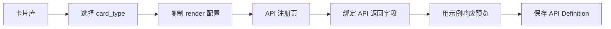

# FastAction 卡片库

Card Gallery 是 FastAction 的卡片样式和协议目录。它帮助开发者选择卡片、复制协议 JSON，并在 API 注册时完成返回字段绑定。

```text
入口：
  Workbench: /fastaction/cards

主要用户：
  - 注册企业既有 API 的平台工程师
  - 实现宿主渲染器的前端工程师
  - 审核结果展示样式的产品团队
```

## 1. 设计边界

FastAction 卡片是 UI 协议。它定义 API 编排结果应该如何展示，但不包含业务逻辑，也不执行业务 API。

```text
FastAction 负责：
  - 通用卡片定义
  - 字段绑定样例
  - 示例响应结构
  - 兜底渲染规则
  - 可复制的 CardDefinition 和 render 配置

宿主系统负责：
  - 真实 Vue/React/Native 组件
  - 领域专属视觉扩展
  - 业务路由和点击动作
  - 产品界面中的最终渲染
```

## 2. 卡片分层

| 分层 | 含义 | 示例 | 是否进入核心 |
|---|---|---|---|
| 协议核心卡片 | 稳定通用的结果展示协议 | `list_card`、`detail_card`、`metric_card`、`result_card`、`confirm_card`、`picker_card`、`missing_params_card`、`generic_data_card` | 是 |
| 企业业务样例 | 常见企业系统模式，可复制后改名使用 | `todo_card`、`progress_card`、`attachment_result_card`、`activity_feed_card`、`risk_alert_card`、`daily_brief_card` | 否 |
| 宿主 UI 样例 | FastAction 外围的产品专属 UI | `chat_message_card`、`attachment_preview_card`、`quick_action_chip`、`notification_item_card` | 否 |

## 3. 注册流程



在 API 注册页，开发者应按这个流程操作：

```text
1. 选择 API 能力。
2. 打开卡片绑定 Tab。
3. 选择 card_type。
4. 粘贴或编辑 field_bindings。
5. 粘贴示例 API 响应。
6. 检查预览效果。
7. 保存 API Definition。
```

## 4. 可复制协议

每个 Gallery 卡片会先展示两种视觉预览，再提供可复制 JSON。

```text
卡片本体：
  该卡片协议单独渲染后的效果。

聊天窗口效果：
  同一张卡片嵌入 assistant 消息气泡后的效果，方便开发者检查
  对话界面中的间距、密度和层级。
```

每个卡片提供三类复制动作。

```text
复制 Definition：
  注册到 Card Registry 的 CardDefinition 数据。

复制 Render：
  写入 API 能力的 APIDefinition.render 配置。

复制响应：
  用于预览和测试的 API 示例响应。
```

`CardDefinition` 示例：

```json
{
  "card_type": "list_card",
  "name": {
    "en": "List card",
    "zh": "列表卡"
  },
  "category": "protocol",
  "data_contract": {
    "type": "object",
    "required": ["title", "items"],
    "properties": {
      "title": { "type": "string" },
      "subtitle": { "type": "string" },
      "items": { "type": "array" }
    }
  },
  "states": ["loading", "success", "empty", "error"],
  "fallback": {
    "card_type": "generic_data_card"
  }
}
```

API render 绑定示例：

```json
{
  "card_type": "list_card",
  "fallback_card_type": "generic_data_card",
  "field_bindings": {
    "title": "$.data.title",
    "subtitle": "$.data.summary",
    "items": "$.data.items",
    "item_title": "$.title",
    "item_subtitle": "$.owner_name",
    "item_meta": "$.status_name"
  }
}
```

API 响应示例：

```json
{
  "data": {
    "title": "Pending tasks",
    "summary": "3 tasks require attention",
    "items": [
      {
        "id": "task_001",
        "title": "Review contract",
        "owner_name": "Maya",
        "status_name": "Due today"
      }
    ]
  }
}
```

## 5. 渲染规则

宿主渲染器应遵循：

```text
1. 优先渲染 selected card_type。
2. selected renderer 不存在时，使用 fallback_card_type。
3. 两者都不存在时，使用 generic_data_card。
4. 执行错误不能被静默隐藏。
5. 写操作必须进入 confirm_card 或宿主等价确认 UI。
6. 必填参数缺失必须通过 missing_params_card 明确展示。
```

## 6. 样式原则

FastAction 卡片应紧凑、可读、面向生产。

```text
布局：
  - 标题清晰
  - 元信息短
  - 列表长度受控
  - 空状态和错误状态稳定

视觉：
  - 中性底色
  - 仅在需要时使用语义色
  - 8-12px 圆角
  - 不使用纯装饰元素

开发者易用性：
  - 每个样例都有响应 JSON
  - 每个样例都有 field_bindings
  - 每个样例都可复制
```

## 7. 宿主 Adapter 样例

宿主系统可以在自己的 adapter 文档旁增加领域卡片。这些卡片可以在 Gallery 中作为样例展示，但除非具备广泛复用性，否则不应该进入 FastAction 核心。

```text
适合进入核心：
  任意写 API 都会用到的通用确认卡。

适合作为宿主样例：
  某个产品首页专属的项目 Hero 卡。
```

这种分层能保持开源引擎干净，同时让真实业务接入容易理解。
