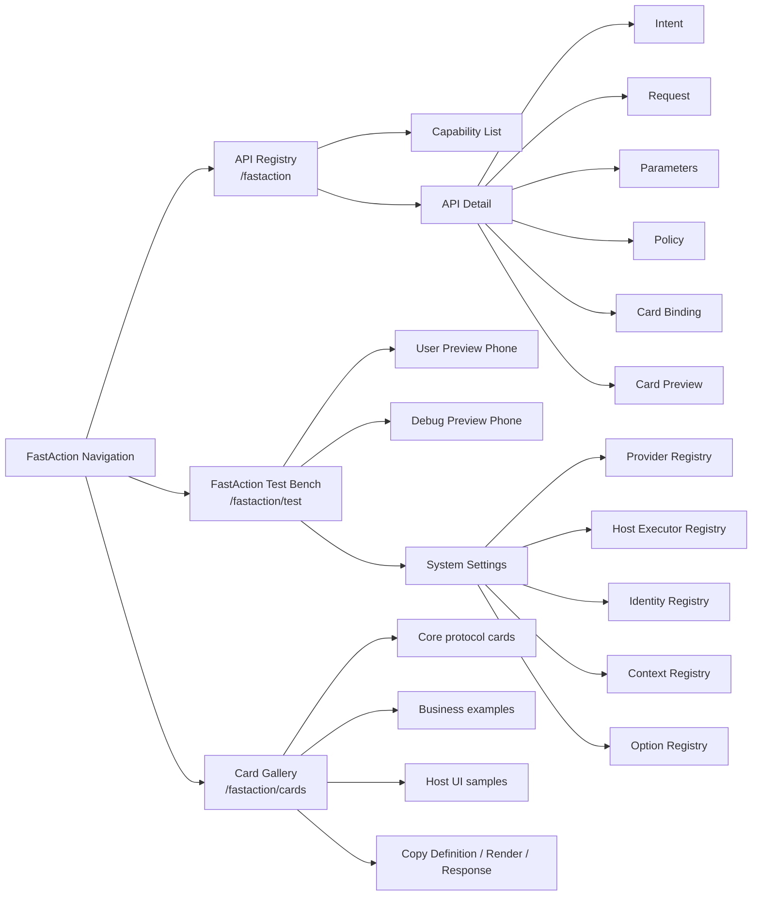

# FastAction Workbench / 工作台设计

The FastAction Workbench is the generic administration UI for API registration and runtime testing. It belongs to FastAction because it edits engine-level definitions and protocols. Host applications may embed it, extend it, or replace it.

FastAction 工作台是通用的 API 注册和运行测试界面。它属于 FastAction，因为它维护的是引擎级定义和协议。宿主业务系统可以嵌入、扩展或替换它。

## 1. Product Boundary / 产品边界

```text
Workbench owns:
  - API definitions
  - intent examples and keywords
  - request method/path/auth mode
  - parameter source rules
  - risk and confirmation policy
  - field binding
  - card preview
  - provider configuration by secret_ref
  - identity templates
  - context entity definitions
  - option definitions
  - test-bench conversations and traces

Host application owns:
  - business registration data lifecycle if it is generated from the host
  - real user sessions and tokens
  - real business data
  - real file storage
  - real API execution
  - final authorization
```

```text
Workbench must stay generic:
  - Use generic examples such as workspace, customer, order, ticket, task, and attachment.
  - Do not hard-code host business words, IDs, routes, dictionaries, or role policies.
  - Do not call host business APIs from the generic test bench.
  - Host-specific demos belong in the host application, not in FastAction Workbench.
```

```text
工作台负责：
  - API 定义
  - 意图示例和关键词
  - 请求方法、路径和鉴权模式
  - 参数来源规则
  - 风险和确认策略
  - 字段绑定
  - 卡片预览
  - 基于 secret_ref 的 Provider 配置
  - 身份模板
  - 上下文实体定义
  - 字典和枚举定义
  - 测试台对话和 Trace

宿主系统负责：
  - 如果注册数据来自宿主系统，由宿主管理具体业务注册数据生命周期
  - 真实用户会话和 token
  - 真实业务数据
  - 真实文件存储
  - 真实 API 执行
  - 最终鉴权
```

```text
工作台必须保持通用：
  - 只使用 workspace、customer、order、ticket、task、attachment 等通用样例。
  - 不硬编码宿主业务词、业务 ID、业务路由、业务字典或角色策略。
  - 通用测试台不直接调用宿主业务 API。
  - 宿主专用演示应放在宿主系统内，而不是放进 FastAction Workbench。
```

## 2. Navigation / 入口



## 3. API Registry Page / API 注册页

The API Registry page is an integration wizard, not a raw configuration table. Its primary user is an enterprise engineer who understands existing APIs but does not yet know the FastAction framework.

API 注册页是接入向导，不是裸配置表。它的主要用户是了解企业既有 API、但还不了解 FastAction 框架的接入工程师。

Functional blocks:

```text
Top summary:
  Engine health, registered capability count, provider count, identity count, and active model-pool status.
  Model-pool status is resolved from Provider capabilities and provider_id.

Left list:
  Search by API ID, name, path, card type, operation type, and keyword.

Center wizard:
  Step 1 Basic: name the capability.
  Step 2 Intent: describe when users will ask for it.
  Step 3 Request: connect method, endpoint, auth, timeout, and retry behavior.
  Step 4 Preparation: configure each API parameter's value source. Sources can
    be user input, reusable option sets, runtime context, attachment upload
    results, or defaults.
  Step 5 Policy: define permission markers, risk level, confirmation, and idempotency.
  Step 6 Result: choose card type, bind response fields, and preview the card.
  Step 7 Test: run one natural-language sentence before publishing.
  Step 8 JSON: inspect the complete protocol payload.

Right inspector:
  Registration completeness checklist, current-step summary, card preview,
  sample API response, available card contracts, and recent runs.
```

功能块：

```text
顶部摘要：
  引擎健康状态、能力数量、Provider 数量、身份数量和模型池状态。
  模型池状态由 Provider capabilities 和 provider_id 动态解析。

左侧列表：
  支持按 API ID、名称、路径、卡片类型、操作类型和关键词搜索。

中间向导：
  Step 1 基础：命名能力。
  Step 2 意图：说明用户什么时候会问到它。
  Step 3 请求：连接 method、endpoint、鉴权、超时和重试。
  Step 4 调用准备：逐个配置 API 参数的取值方式。参数可以来自
    用户补充、可复用字典、运行上下文、附件上传结果或默认值。
  Step 5 权限确认：定义权限标识、风险等级、确认策略和幂等性。
  Step 6 返回展示：选择卡片、绑定返回字段并预览。
  Step 7 测试发布：用一句自然语言完成发布前验证。
  Step 8 JSON：检查完整协议结构。

右侧 Inspector：
  注册完成度 Checklist、当前步骤摘要、卡片预览、示例响应、
  可选卡片协议和最近 Runs。
```

Preparation UX / 调用准备体验：

```text
Parameter matrix:
  - Shows parameter name, business label, type, source kind, option-set binding,
    raw source expression, required flag, and delete action.
  - Every control writes back to APIDefinition.parameters JSON Schema.

Shared option-set library:
  - OptionSet is a reusable parameter value source, not a separate business module.
  - One option set can be referenced by many API parameters.
  - Usage count shows how many registered APIs currently reference it.
  - Missing option-set references are surfaced in the completion checklist.

Option-set detail:
  - Static mode maintains code | name | aliases rows.
  - API mode records source API ID, endpoint, method, list path, code field,
    and name field so host adapters can sync dictionary options from existing
    enterprise APIs.
  - Metadata JSON remains available for advanced host-specific hints.
```

```text
参数矩阵：
  - 展示参数名、业务含义、类型、取值来源、字典绑定、原始来源表达式、
    是否必填和删除动作。
  - 每个控件都会回写到 APIDefinition.parameters JSON Schema。

共享字典库：
  - OptionSet 是可复用的参数取值来源，不是独立的业务模块。
  - 一个字典可以被多个 API 参数引用。
  - 复用次数显示当前有多少 API 正在引用。
  - 引用了不存在的字典时，会进入完成度检查和调用准备警告。

字典详情：
  - 静态模式维护 code | 名称 | 别名。
  - API 来源模式记录来源 API ID、endpoint、method、列表路径、
    code 字段和 name 字段，方便宿主适配器从企业既有列表接口同步选项。
  - 元数据 JSON 保留给高级宿主提示。
```

## 4. Test Bench / 测试台

The test bench validates runtime behavior before a host application exposes the capability to users.

测试台用于在宿主系统面向用户开放能力前验证运行行为。

```text
Input:
  - text
  - voice transcription through an ASR provider or host ASR adapter
  - attachment metadata for images, PDF, video, audio, DWG/DXF, and generic files
  - optional explicit params
  - optional context JSON

Preview:
  - user-facing phone preview
  - debug phone preview
  - action, api_id, params, confidence, run_id
  - provider, configured model, runtime model version
  - raw planner output
  - candidate list and rejection reason

System settings:
  - collapsible by default
  - provider editor
  - identity editor
  - context/entity editor
  - option editor
```

```text
输入：
  - 文本
  - 通过 ASR Provider 或宿主 ASR Adapter 转写的语音
  - 图片/文件附件元数据
  - 可选显式参数
  - 可选上下文 JSON

预览：
  - 面向用户的手机预览
  - 调试手机预览
  - action、api_id、params、confidence、run_id
  - provider、配置模型、运行模型版本
  - 原始 Planner 输出
  - 候选列表和拒绝原因

系统设置：
  - 默认折叠
  - Provider 编辑
  - Identity 编辑
  - Context/Entity 编辑
  - Option 编辑
```

## 5. Card Gallery / 卡片库

The Card Gallery is the visual and copyable catalog for result cards. It should stay generic and teach developers how to register card definitions and bind API response fields.

Card Gallery 是结果卡片的可视化和可复制目录。它必须保持通用，用来指导开发者注册卡片定义并绑定 API 返回字段。

Functional blocks:

```text
Header:
  Total cards, core protocol count, business example count, host UI sample count.

Filters:
  Group filter and card_type / purpose / style search.

Card item:
  Standalone card image, chat-window preview, purpose, style tags, and copy buttons.

Copy actions:
  CardDefinition JSON, APIDefinition.render JSON, and sample API response JSON.
```

功能块：

```text
顶部：
  卡片总数、核心协议数量、业务样例数量、宿主 UI 样例数量。

筛选：
  分组筛选，以及 card_type / 用途 / 样式搜索。

卡片项：
  卡片本体、聊天窗口效果、用途说明、样式标签和复制按钮。

复制动作：
  CardDefinition JSON、APIDefinition.render JSON、示例 API 响应 JSON。
```

Card tiers:

```text
Protocol cards:
  Stable FastAction core contracts.

Business examples:
  Reusable enterprise patterns that should be copied or renamed by host apps.

Host UI samples:
  Product-specific UI around FastAction; documented as adapter examples only.
```

卡片分层：

```text
协议核心卡片：
  FastAction 稳定核心协议。

企业业务样例：
  可复用企业模式，宿主系统可以复制或改名。

宿主 UI 样例：
  FastAction 外围的产品专属 UI，只作为 Adapter 示例。
```

## 6. No-Match, Fallback, and Rejection / 未命中、兜底和拒绝

```text
no_match:
  No registered capability matches the user request.
  The test bench can use fixed, llm_answer, or hybrid fallback.

permission_denied:
  A capability was matched, but identity, policy, or context denied access.
  The reply should show the matched capability, reason, required permission,
  and eligible actor types when known.

clarify:
  A capability was matched, but required parameters or entity resolution are ambiguous.
  The reply should request the missing value or show a picker card.
  The payload should include clarify.missing_params and clarify.missing_param_details.

provider_failure:
  The LLM or ASR provider failed.
  The reply should fail closed or fall back according to configured strategy.
```

```text
no_match：
  没有已注册能力匹配用户请求。
  测试台可配置 fixed、llm_answer 或 hybrid 兜底。

permission_denied：
  已命中能力，但身份、策略或上下文不允许调用。
  回复应展示命中的能力、拒绝原因、需要的权限，以及已知可调用身份。

clarify：
  已命中能力，但参数缺失或实体校准不确定。
  回复应追问缺失值或展示选择卡。
  返回结构应包含 clarify.missing_params 和 clarify.missing_param_details。

provider_failure：
  LLM 或 ASR Provider 调用失败。
  按配置选择 fail closed 或兜底。
```

Clarification card:

```text
The test bench should render a missing-parameter card with:
  - matched API ID
  - missing parameter label and technical name
  - parameter type
  - source hints such as context.*, params.*, clarify
  - option_set or resolve_entity when present
  - a Params JSON template action for debugging
```

补参数卡片：

```text
测试台应渲染缺失参数卡片，包含：
  - 已命中的 API ID
  - 缺失参数的人类名称和技术字段名
  - 参数类型
  - context.*、params.*、clarify 等来源提示
  - 存在时展示 option_set 或 resolve_entity
  - 生成 Params JSON 模板的调试动作
```

## 7. Confirmation UX / 确认交互

Write operations must be confirmable before execution. The test bench should display confirmation cards but should not call real business APIs unless a host executor is explicitly wired for that environment.

写操作必须可确认。测试台应展示确认卡；除非当前环境显式接入 Host Executor，否则不直接执行真实业务 API。

A Host Executor has two separate parts:

```text
1. HostExecutorDefinition in FastAction Registry:
   id, host_app, kind, matcher, input_contract, output_contract, runtime hints.
2. Runtime implementation in the Host App:
   browser upload, host proxy, webhook, or another adapter using real user auth.
```

Host Executor 分成两部分：

```text
1. FastAction Registry 里的 HostExecutorDefinition：
   id、host_app、kind、matcher、input_contract、output_contract、runtime 提示。
2. Host App 里的真实运行实现：
   浏览器上传、宿主代理、Webhook 或其他使用真实用户权限的 adapter。
```

Default generic behavior:

```text
1. The planner returns confirm or invoke_api.
2. The test bench renders the confirmation and debug trace.
3. After confirmation, the generic test bench writes a simulated ExecutionResult.
4. Real execution requires a matching HostExecutorDefinition and a host application's executor adapter.
```

默认通用行为：

```text
1. Planner 返回 confirm 或 invoke_api。
2. 测试台渲染确认卡和调试 Trace。
3. 用户确认后，通用测试台只写入模拟 ExecutionResult。
4. 真实业务执行需要匹配 HostExecutorDefinition，并由宿主系统的 executor adapter 实现。
```

Provider and model-pool behavior:

```text
1. The bench lists ProviderConfig rows from the registry.
2. It selects a default provider by capabilities, preferring model_pool +
   balanced_routing + chat, then any active chat provider.
3. It loads model-pool status through
   /fastaction/provider-configs/{provider_id}/model-pool.
4. It must not hard-code qwen-balanced-service or any other vendor ID in the
   generic UI. Vendor-specific behavior belongs to provider presets/plugins.
```

Provider 和模型池行为：

```text
1. 测试台从注册表读取 ProviderConfig 列表。
2. 默认 provider 按能力选择，优先 model_pool + balanced_routing + chat，
   然后回退到任意 active chat provider。
3. 模型池状态通过
   /fastaction/provider-configs/{provider_id}/model-pool 加载。
4. 通用 UI 不能硬编码 qwen-balanced-service 或任何厂商 ID。
   厂商专属行为属于 provider preset/plugin。
```

Host Executor visibility:

```text
The Test Bench includes a Host Executor overview so developers can see which
execution contracts are registered. The open-source bench shows registry
definitions only; host applications may additionally show whether a same-ID
runtime implementation is wired in the current app.
```

Host Executor 可见性：

```text
测试台包含 Host Executor 概览，让开发者能看到已注册的执行契约。
开源测试台只展示注册定义；宿主应用可以额外展示当前应用是否已经接入
同 ID 的 runtime implementation。
```

```text
Confirmation card should include:
  - operation title
  - API ID
  - method and path
  - risk level
  - key parameters
  - affected resource names when available
  - attachment names when available
  - cancel and confirm actions
```

```text
确认卡应包含：
  - 操作标题
  - API ID
  - 方法和路径
  - 风险等级
  - 关键参数
  - 可用时展示受影响资源名称
  - 可用时展示附件名称
  - 取消和确认执行动作
```

Skip-confirm policy:

```text
Allowed only for low-impact write actions.
Must bind user_id + api_id + tenant/workspace scope + parameter fingerprint + TTL.
Never allowed for destructive, external, payment, notification, or batch-change actions.
```

## 8. Context and Entity Debugging / 上下文和实体调试

```text
Debug panel should show:
  - entity type
  - raw mention
  - candidate provider
  - candidates
  - score
  - match reason
  - selected entity
  - whether clarification is required
  - final injected parameter value
```

```text
调试面板应展示：
  - 实体类型
  - 原始 mention
  - 候选提供器
  - 候选列表
  - 分数
  - 匹配原因
  - 选中实体
  - 是否需要追问
  - 最终注入参数值
```

Example:

```text
User says:
  Show orders for customer Acme.

Resolver:
  mention = "Acme"
  entity_type = "customer"
  candidates = ["Acme Inc.", "Acme Asia"]
  action = clarify if scores are too close
```

## 9. Field Binding / 字段绑定

```json
{
  "card_type": "list_card",
  "field_bindings": {
    "title": "Todo tasks",
    "items": "$.data.tasks",
    "summary.count": "$.data.count",
    "empty_message": "No tasks found"
  }
}
```

Binding preview should show:

```text
1. sample API response
2. binding expression result
3. final card props
4. card preview
5. validation errors
```

字段绑定预览应展示：

```text
1. 示例 API 响应
2. 绑定表达式结果
3. 最终 card props
4. 卡片预览
5. 校验错误
```

## 10. Workbench Persistence / 工作台持久化

```text
Persist:
  - definitions
  - provider config metadata
  - identity templates
  - context and option definitions
  - card definitions and bindings
  - test messages
  - traces

Do not persist:
  - real user tokens
  - real provider keys
  - binary attachments by default
  - business records
```

```text
持久化：
  - 定义类数据
  - Provider 配置元数据
  - 身份模板
  - 上下文和字典定义
  - 卡片定义和字段绑定
  - 测试消息
  - Trace

不持久化：
  - 真实用户 token
  - 真实 Provider key
  - 默认不保存二进制附件
  - 业务记录
```

## 11. UI Principles / UI 原则

```text
1. Start from the enterprise user's integration job, not from internal registries.
2. Make API registration a guided flow: define, match, connect, prepare, govern,
   render, test, then inspect JSON.
3. Keep registration dense and scannable.
4. Prefer local scrolling inside panels over long full-page scrolling.
5. Keep settings and resource registries separate from the API wizard unless the
   current API references them.
6. Use fixed phone-width previews in the test bench.
7. Show debug metadata in a wider trace panel.
8. Keep large JSON blocks collapsible.
9. Never hide permission denial behind a generic fallback.
10. Make field binding, card preview, and test outcome visible before saving.
```

```text
1. 从企业用户的 API 接入任务出发，而不是从引擎内部 Registry 出发。
2. API 注册应是向导流程：定义、匹配、连接、准备、治理、展示、测试、
   再检查 JSON。
3. 注册页要紧凑、可扫读。
4. 优先使用面板内局部滚动，减少整页滚动。
5. 系统设置和资源 Registry 应与 API 向导分开，除非当前 API 正在引用它们。
6. 测试台手机预览保持固定手机宽度。
7. 调试 Trace 面板要足够宽。
8. 大块 JSON 默认可折叠。
9. 权限拒绝不能被泛化兜底掩盖。
10. 保存前应能看到字段绑定、卡片预览和测试结果。
```
