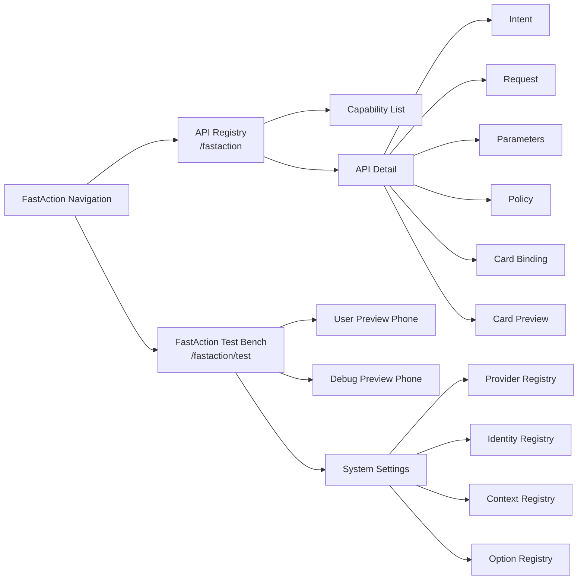

# FastAction Workbench / 工作台设计

The FastAction Workbench is the generic administration UI for API registration and runtime testing. It belongs to FastAction because it edits engine-level definitions and protocols. Host applications may embed it, extend it, or replace it.

FastAction 工作台是通用的 API 注册和运行测试界面。它属于 FastAction，因为它维护的是引擎级定义和协议。宿主业务系统可以嵌入、扩展或替换它。

## 1. Product Boundary / 产品边界

```text
Workbench owns:
  - API definitions
  - intent examples and keywords
  - request method/path/auth mode
  - parameter source rules
  - risk and confirmation policy
  - field binding
  - card preview
  - provider configuration by secret_ref
  - identity templates
  - context entity definitions
  - option definitions
  - test-bench conversations and traces

Host application owns:
  - business registration data lifecycle if it is generated from the host
  - real user sessions and tokens
  - real business data
  - real file storage
  - real API execution
  - final authorization
```

```text
工作台负责：
  - API 定义
  - 意图示例和关键词
  - 请求方法、路径和鉴权模式
  - 参数来源规则
  - 风险和确认策略
  - 字段绑定
  - 卡片预览
  - 基于 secret_ref 的 Provider 配置
  - 身份模板
  - 上下文实体定义
  - 字典和枚举定义
  - 测试台对话和 Trace

宿主系统负责：
  - 如果注册数据来自宿主系统，由宿主管理具体业务注册数据生命周期
  - 真实用户会话和 token
  - 真实业务数据
  - 真实文件存储
  - 真实 API 执行
  - 最终鉴权
```

## 2. Navigation / 入口



## 3. API Registry Page / API 注册页

Functional blocks:

```text
Top summary:
  Engine health, registered capability count, provider count, identity count, and active model-pool status.

Left list:
  Search by API ID, name, path, card type, operation type, and keyword.

Center detail:
  Tabs for basic info, intent, request, parameters, policy, card binding, and JSON.

Right preview:
  Card preview, sample API response, field-binding result, and selected capability summary.
```

功能块：

```text
顶部摘要：
  引擎健康状态、能力数量、Provider 数量、身份数量和模型池状态。

左侧列表：
  支持按 API ID、名称、路径、卡片类型、操作类型和关键词搜索。

中间详情：
  基础信息、意图、请求、参数、策略、卡片绑定和 JSON 结构。

右侧预览：
  卡片预览、示例 API 响应、字段绑定结果和当前能力摘要。
```

## 4. Test Bench / 测试台

The test bench validates runtime behavior before a host application exposes the capability to users.

测试台用于在宿主系统面向用户开放能力前验证运行行为。

```text
Input:
  - text
  - voice transcription through an ASR provider or host ASR adapter
  - image/file attachment metadata
  - optional explicit params
  - optional context JSON

Preview:
  - user-facing phone preview
  - debug phone preview
  - action, api_id, params, confidence, run_id
  - provider, configured model, runtime model version
  - raw planner output
  - candidate list and rejection reason

System settings:
  - collapsible by default
  - provider editor
  - identity editor
  - context/entity editor
  - option editor
```

```text
输入：
  - 文本
  - 通过 ASR Provider 或宿主 ASR Adapter 转写的语音
  - 图片/文件附件元数据
  - 可选显式参数
  - 可选上下文 JSON

预览：
  - 面向用户的手机预览
  - 调试手机预览
  - action、api_id、params、confidence、run_id
  - provider、配置模型、运行模型版本
  - 原始 Planner 输出
  - 候选列表和拒绝原因

系统设置：
  - 默认折叠
  - Provider 编辑
  - Identity 编辑
  - Context/Entity 编辑
  - Option 编辑
```

## 5. No-Match, Fallback, and Rejection / 未命中、兜底和拒绝

```text
no_match:
  No registered capability matches the user request.
  The test bench can use fixed, llm_answer, or hybrid fallback.

permission_denied:
  A capability was matched, but identity, policy, or context denied access.
  The reply should show the matched capability, reason, required permission,
  and eligible actor types when known.

clarify:
  A capability was matched, but required parameters or entity resolution are ambiguous.
  The reply should request the missing value or show a picker card.

provider_failure:
  The LLM or ASR provider failed.
  The reply should fail closed or fall back according to configured strategy.
```

```text
no_match：
  没有已注册能力匹配用户请求。
  测试台可配置 fixed、llm_answer 或 hybrid 兜底。

permission_denied：
  已命中能力，但身份、策略或上下文不允许调用。
  回复应展示命中的能力、拒绝原因、需要的权限，以及已知可调用身份。

clarify：
  已命中能力，但参数缺失或实体校准不确定。
  回复应追问缺失值或展示选择卡。

provider_failure：
  LLM 或 ASR Provider 调用失败。
  按配置选择 fail closed 或兜底。
```

## 6. Confirmation UX / 确认交互

Write operations must be confirmable before execution. The test bench should display confirmation cards but should not call real business APIs unless a host executor is explicitly wired for that environment.

写操作必须可确认。测试台应展示确认卡；除非当前环境显式接入 Host Executor，否则不直接执行真实业务 API。

```text
Confirmation card should include:
  - operation title
  - API ID
  - method and path
  - risk level
  - key parameters
  - affected resource names when available
  - attachment names when available
  - cancel and confirm actions
```

```text
确认卡应包含：
  - 操作标题
  - API ID
  - 方法和路径
  - 风险等级
  - 关键参数
  - 可用时展示受影响资源名称
  - 可用时展示附件名称
  - 取消和确认执行动作
```

Skip-confirm policy:

```text
Allowed only for low-impact write actions.
Must bind user_id + api_id + tenant/workspace scope + parameter fingerprint + TTL.
Never allowed for destructive, external, payment, notification, or batch-change actions.
```

## 7. Context and Entity Debugging / 上下文和实体调试

```text
Debug panel should show:
  - entity type
  - raw mention
  - candidate provider
  - candidates
  - score
  - match reason
  - selected entity
  - whether clarification is required
  - final injected parameter value
```

```text
调试面板应展示：
  - 实体类型
  - 原始 mention
  - 候选提供器
  - 候选列表
  - 分数
  - 匹配原因
  - 选中实体
  - 是否需要追问
  - 最终注入参数值
```

Example:

```text
User says:
  Show orders for customer Acme.

Resolver:
  mention = "Acme"
  entity_type = "customer"
  candidates = ["Acme Inc.", "Acme Asia"]
  action = clarify if scores are too close
```

## 8. Field Binding / 字段绑定

```json
{
  "card_type": "list_card",
  "field_bindings": {
    "title": "Todo tasks",
    "items": "$.data.tasks",
    "summary.count": "$.data.count",
    "empty_message": "No tasks found"
  }
}
```

Binding preview should show:

```text
1. sample API response
2. binding expression result
3. final card props
4. card preview
5. validation errors
```

字段绑定预览应展示：

```text
1. 示例 API 响应
2. 绑定表达式结果
3. 最终 card props
4. 卡片预览
5. 校验错误
```

## 9. Workbench Persistence / 工作台持久化

```text
Persist:
  - definitions
  - provider config metadata
  - identity templates
  - context and option definitions
  - card definitions and bindings
  - test messages
  - traces

Do not persist:
  - real user tokens
  - real provider keys
  - binary attachments by default
  - business records
```

```text
持久化：
  - 定义类数据
  - Provider 配置元数据
  - 身份模板
  - 上下文和字典定义
  - 卡片定义和字段绑定
  - 测试消息
  - Trace

不持久化：
  - 真实用户 token
  - 真实 Provider key
  - 默认不保存二进制附件
  - 业务记录
```

## 10. UI Principles / UI 原则

```text
1. Keep registration dense and scannable.
2. Prefer local scrolling inside panels over long full-page scrolling.
3. Keep settings collapsible by default.
4. Use fixed phone-width previews in the test bench.
5. Show debug metadata in a wider trace panel.
6. Keep large JSON blocks collapsible.
7. Never hide permission denial behind a generic fallback.
8. Make field binding and card preview visible before saving.
```

```text
1. 注册页要紧凑、可扫读。
2. 优先使用面板内局部滚动，减少整页滚动。
3. 系统设置默认折叠。
4. 测试台手机预览保持固定手机宽度。
5. 调试 Trace 面板要足够宽。
6. 大块 JSON 默认可折叠。
7. 权限拒绝不能被泛化兜底掩盖。
8. 保存前应能看到字段绑定和卡片预览。
```
